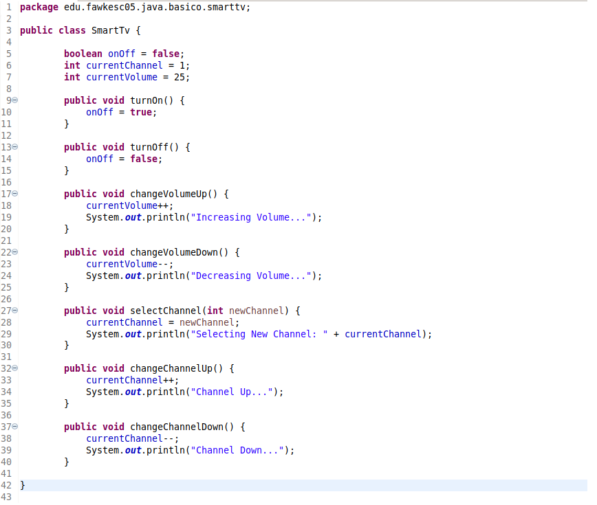
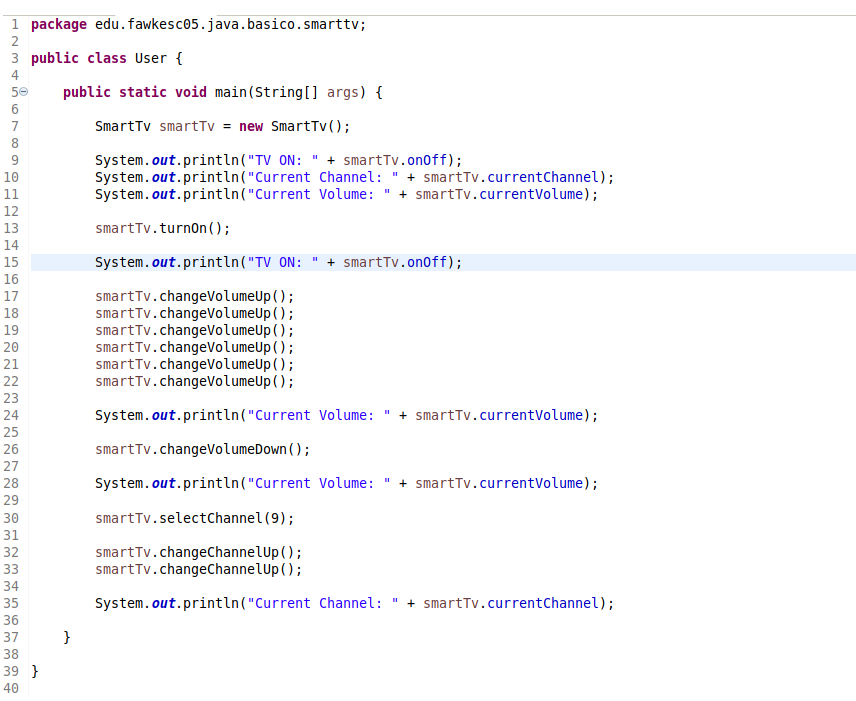

# Java Básico

Repositório de exemplos e exercícios relacionados ao módulo básico de Java (Bootcamp Pan Java Developer - DIO)

### [Exercício de Criação de Algoritmo "SmartTV"](./SmartTv/sistema_smart_tv/src/edu/fawkesc05/java/basico/smarttv)

